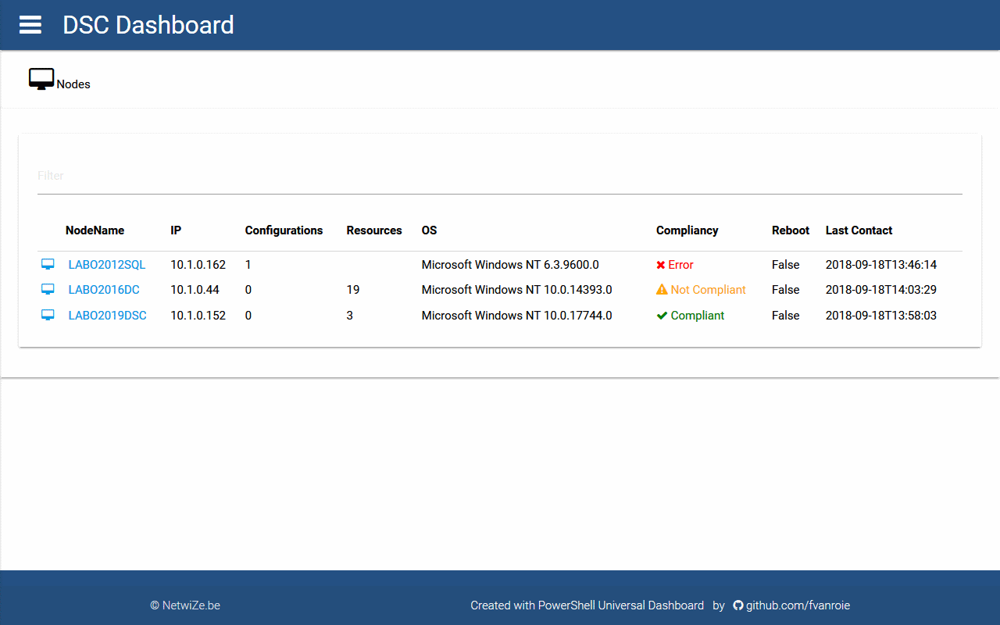

# DscDashboard


## Description

This is a PowerShell module and a dashboard that can connect to a DSC Pull Server database. The GUI displays
statistics and allows you to view the Status Reports generated by your LCM clients. It is a web interface
that uses the data from the DSC Pull Server framework and makes it easily available to browse.

The website can be hosted on the DSC Pull Server or as a separate server.
A Dockerfile is also available to quickly test the DscDashboard functionality.


## Prerequisites

### DSC Pull Service with
- Windows Server 2016 Core Semi-Annual Channel release 1803   *or*
- [Windows Server 2019](https://www.microsoft.com/en-us/cloud-platform/windows-server-trial)
- SQL Server backend

You need to have a DSC Pull Service from WMF 5.1 that is
[configured to use a SQL Server](https://blogs.technet.microsoft.com/askpfeplat/2018/07/09/configuring-a-powershell-dsc-web-pull-server-to-use-sql-database/)
backend. The integrated MDB or ESENT databases are not supported by this module.

__Note:__
> SQL Server support will not be added to previous versions of WMF 5.1 (or earlier) and
> will only be available on Windows Server versions **greater than or equal to 17090**.

This means you need to have at least Windows 2016 SAC 1803 or Windows 2019.

### Universal Dashboard Module

The dashboard is created using the [Universal Dashboard](https://ironmansoftware.com/universal-dashboard) module for PowerShell.
You need to have this module installed on the server hosting the dashboard. You can use either the
[Community](https://www.powershellgallery.com/packages/UniversalDashboard.Community/) or the
[Full edition](https://www.powershellgallery.com/packages/UniversalDashboard/) depending on your usage and license requirements.


## How to use

Open a browser on the server and browse to http://ipaddress[:port] to test the dashboard:




## Notes

```yaml
   Name: DscDashboard
   Created by: fvanroie, NetwiZe.be
   Created Date: September 15 2018
```