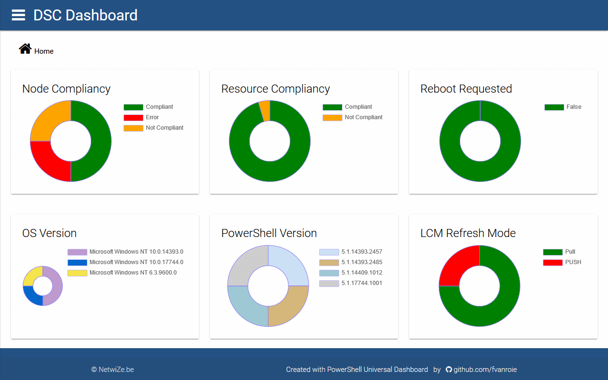

# DSC Dashboard Dockerfile

## Description

This [Docker](http://docker.com) container hosts the [DscDashboard](https://github.com/fvanroie/DscDashboard) module and all of its dependencies.
It can be used to quickly test the DSC Dashboard in your *test* environment. The following packages are included in the image:
- *Ubuntu 18.04 LTS*
- [PowerShell 6.1.0](https://hub.docker.com/r/microsoft/powershell/) base image
    - [DscDashboard](https://github.com/fvanroie/DscDashboard) module
    - [UniversalDashboard.Community](http://poshud.com) module <sup>*</sup>
- [ODBC Driver for SQL Server](https://docs.microsoft.com/en-us/sql/connect/odbc/linux-mac/system-requirements) <sup>*</sup>

<sup>*</sup> by building the image you accept the End-User License agreement of these packages

#### Disclaimer

> *This container is provided as a proof-of-concept for *testing purposes* only.
> If you want to run the DSC dashboard in a production environment consider using
> [IIS with Domain authentication and https binding](#../docs/Installation_IIS.md).*
>
> *The information in the DSC database should be regarded as **extremely sensitive**
> because it contains the configurations of your environment!*


## Usage

### Installation

To build the `dscdashboard` image from source:

```bash
git clone https://github.com/fvanroie/DscDashboard.git
cd DscDashboard
docker build -t dscdashboard .
```

If the build succeeded, you will see:

    Successfully built <imageid>
    Successfully tagged dscdashboard:latest


### Test

Test the newly built image, bind associated public port and provide a SQL Server connection string:

```bash
docker run --rm -p 8080:80 -e DSC_SQL='SERVER=<hostname>; Uid=<user>; Pwd=<password>' --name dsc dscdashboard
```

Change the `<hostname>`, `<user>` and `<password>` in the `DSC_SQL` argument to the appropriate values to
connect to the DSC database on the SQL Server. This should be a temporary *read-only* account on the DSC database
for testing purposes.

You can also set the `DSC_SQL` environment variable by editing the Dockerfile and rebuilding the image.


After a little while you should see this message:

    Now listening on: http://0.0.0.0:80
    Application started. Press Ctrl+C to shut down.

Browse to the URL `http://ipaddress:8080` of the DSC Dashboard. Press Ctrl-C to stop the website and exit the container when done testing.



### Run

To run the container in the background:

```bash
docker run -d -p 8080:80 -e DSC_SQL='SERVER=<hostname>; Uid=<user>; Pwd=<password>' --name dsc dscdashboard
```


### Debug

You can troubleshoot or debug the containter with the following command:

```bash
docker run --rm -it -p 8080:80 --name dsc dscdashboard -c pwsh
```

This will give you an interactive PowerShell prompt. Type `exit` to stop the container session.


### Services

Service     | Port | Usage
------------|------|------
DscDashboard|   80 | Use `dscdashboard run` and visit `http://ipaddress[:port]` in your browser.


### Volumes

Volume          | Description
----------------|-------------
none            | No volumes are required
